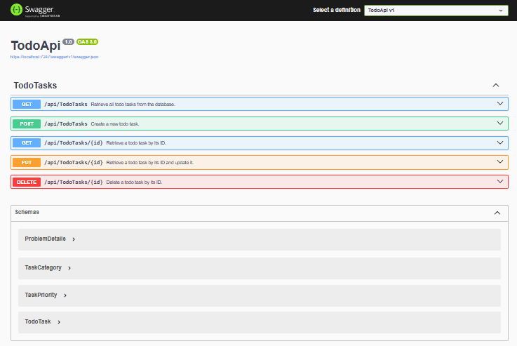
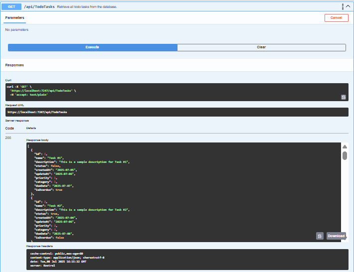
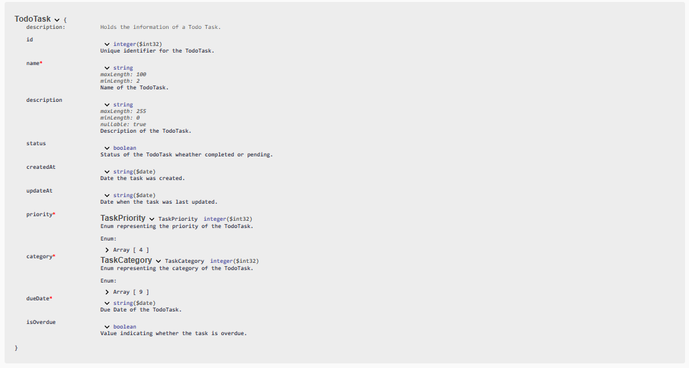

# 📝 Todo Web API – .NET Core

A clean, scalable, and production-ready **Todo List API** built with **ASP.NET Core** and **Entity Framework Core**.  
This API provides endpoints to manage tasks, track overdue status, and organize todos with modern REST principles.

---

## 📌 Features

- ✅ Create, Read, Update, Delete (CRUD) operations for tasks
- ⏰ Auto-overdue detection with background service
- 📅 Task due date tracking
- 🔒 Proper validation and exception handling
- 🧪 Integrated Swagger UI for testing endpoints
- 🧱 Clean architecture: Controller → Service → Data Layer
- 💬 XML comments for built-in documentation

---

## 🧰 Tech Stack

- **.NET 8 / ASP.NET Core Web API**
- **C#**
- **Entity Framework Core**
- **SQL Server**
- **Swagger (Swashbuckle)**
- **HostedService (for overdue checker)**

---

## 🚀 Getting Started

### 📦 Prerequisites

- [.NET 8 SDK](https://dotnet.microsoft.com/download)
- SQL Server or Docker with SQL Server image
- Visual Studio / VS Code

### 🔧 Setup

1. **Clone the repository**
   ```bash
   git clone https://github.com/your-username/todo-api.git
   cd todo-api
   ```

2. **Configure the connection string**

   In `appsettings.json`, update the `dbcs` connection string:
   ```json
   "ConnectionStrings": {
     "dbcs": "Server=localhost;Database=TodoDB;Trusted_Connection=True;"
   }
   ```

3. **Apply Migrations**
   ```bash
   dotnet ef database update
   ```

4. **Run the application**
   ```bash
   dotnet run
   ```

5. **Open Swagger**
   Visit `https://localhost:5001/swagger` to test the API.

---

## 🧠 How Overdue Tasks Are Handled

This project includes a `HostedService` (`OverdueCheckerService`) that runs in the background every minute. It checks all tasks:

- If `DueDate < DateTime.UtcNow` and `IsOverdue == false`, it sets `IsOverdue = true`.
- Changes are saved to the database automatically without user interaction.

This allows dynamic overdue tracking without requiring manual updates.

---

## 📒 API Endpoints

| Method | Endpoint           | Description                      |
|--------|--------------------|----------------------------------|
| GET    | `/api/todo`        | Get all tasks                    |
| GET    | `/api/todo/{id}`   | Get task by ID                   |
| POST   | `/api/todo`        | Create a new task                |
| PUT    | `/api/todo/{id}`   | Update a task                    |
| DELETE | `/api/todo/{id}`   | Delete a task                    |

---

## 🖼️ Swagger Documentation

Swagger UI is available by default when running the app. It includes:

- ✅ XML method documentation  
- ✅ Request/response schemas  
- ✅ Try-it-out interface

To access it:
```
https://localhost:5001/swagger
```

---

## 📂 Folder Structure

```
TodoApi/
│
├── Attributes              → Custom attributes(e.g. FutureDate)
├── Controllers/            → API controllers
├── Models/                 → Entity models
├── Exceptions/             → Generic and custom exceptions
├── Services/               → Overdue checker
├── Program.cs              → Entry point
├── appsettings.json        → Configuration
└── TodoApi.csproj
```
---

## Demonstration


---



---



---
